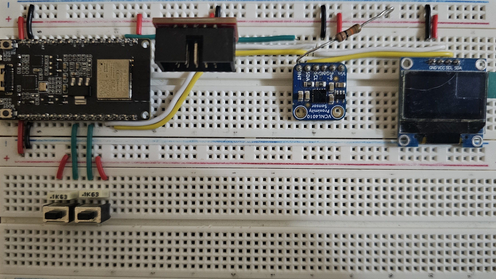

# ESP32-H2 Zigbee Environmental Monitor

Indoor environmental monitor built on the ESP32-H2, running as a Zigbee end
device (not a router) to keep power draw low. Reports temperature, humidity,
and barometric pressure over Zigbee, with an SSD1306 OLED that wakes on a
VCNL4010 proximity interrupt to show live cached readings, then powers off
after a configurable timeout.



## Hardware

| Component | Part | Role |
| --- | --- | --- |
| MCU | ESP32-H2 (Waveshare ESP32-H2-DEV-KIT-N4) | Zigbee end device (no Wi-Fi silicon, no routing) |
| Environmental sensor | Bosch BME280 | Temperature, humidity, pressure (I2C) |
| Proximity sensor | Vishay VCNL4010 | Interrupt-driven proximity, wakes the display (I2C) |
| Display | SSD1306 128x64 OLED | Shows cached readings on wake, sleeps after timeout (I2C, official `esp_lcd` component) |

Build stage: dev board + breakout modules on perfboard (jumper wiring). No
custom PCB — out of scope for this build.

Power target: battery or mains powered end device. Measured idle current on
the bare 3.3V rail (dev-board LEDs deducted) is in line with the ESP32-H2's
datasheet light-sleep figures; see [Power](#power) below.

## Wiring

| Signal | ESP32-H2 GPIO | Connects to | Notes |
| --- | --- | --- | --- |
| I2C SDA | GPIO10 | BME280 SDA, VCNL4010 SDA, SSD1306 SDA | Shared bus, one `i2c_master_bus_handle_t` |
| I2C SCL | GPIO11 | BME280 SCL, VCNL4010 SCL, SSD1306 SCL | Shared bus |
| VCNL4010 INT | GPIO0 | VCNL4010 INT pin | Open-drain, active low; external pull-up fitted. **Verify GPIO0 is safe on your specific board** — it is a boot-mode strapping pin on most ESP32 parts |
| Reset | GPIO12 | Momentary push button to 3.3V, Internal pulldown resistor | Long press (~3s): local reset |
| Display timeout button | GPIO22 | Momentary push button to 3.3V, Internal pulldown resistor | Cycles display auto-off timeout: 10s → 30s → 60s → 10s |
| BME280 I2C address | — | `0x76` | SDO tied low; use `0x77` if SDO is tied high |
| VCNL4010 I2C address | — | `0x13` | Fixed address, not configurable on this part |
| SSD1306 I2C address | — | `0x3C` | Use `0x3D` if the display's SA0/ADDR pin is wired high |

All GPIO assignments are configurable via `idf.py menuconfig` under
**Application Configuration** — the table above reflects this build's
defaults, not hard requirements.

## Software Stack

- **ESP-IDF**: v6.1
- **Zigbee**: `esp-zigbee-lib` v2.x (end device role only)
- **BME280**: custom driver (this repo), forced mode, 1x oversampling ("weather monitoring" profile per Bosch datasheet)
- **VCNL4010**: custom driver (this repo), interrupt-driven proximity wake
- **SSD1306**: official ESP-IDF `esp_lcd` component, manual framebuffer + custom bitmap font (no LVGL)

## Configuration

App-specific settings (I2C pins, sensor intervals, display timeout bounds,
button GPIOs, Zigbee identity strings) live in `firmware/main/Kconfig.projbuild`
and are set via:

``` text
idf.py menuconfig
```

under **Application Configuration**.

### Dependencies

The Zigbee stack dependency is declared in `firmware/main/idf_component.yml`
and resolved automatically by the ESP-IDF Component Manager on build:

``` text
idf.py build
```

No manual cloning of `esp-zigbee-lib` is required.

## Repository Layout

``` text
.
├── docs/
│   ├── datasheets/                 # BME280, VCNL4010, SSD1306 datasheets
│   ├── pinouts/                    # dev board pinout reference
│   └── images/                     # device photos (see top of this file) 
└── firmware/
    ├── components/                 
    │   ├── bme280/                 # VCNL4010 driver                    
    │   │   ├── include/
    │   │   │   ├── bme280_def.h
    │   │   │   └── bme280.h
    │   │   └── bme280.c
    │   │   
    │   └── bme280/                 # bme280 driver                    
    │       ├── include/
    │       │   ├── bme280_def.h
    │       │   └── bme280.h
    │       └── bme280.c
    ├── main/
    │   ├── Kconfig.projbuild       # project settings
    │   ├── idf_component.yml       # project dependencies
    │   ├── app_main.c              # startup, power management init
    │   ├── i2c_bus.c/.h            # shared I2C bus helper
    │   ├── display.c/.h            # SSD1306 framebuffer + font
    │   ├── task_manager.c/.h       # sensor/display/button task orchestration
    │   └── zigbee.c/.h             # Zigbee stack, data model, attribute reporting
    └── sdkconfig.defaults
```

## Display Behavior

1. VCNL4010 proximity interrupt fires (hand near sensor).
2. MCU wakes, shows the most recently cached BME280 reading on the SSD1306.
3. Display stays on for the configured timeout, then powers off.
4. BME280 is sampled on its own independent ~1 minute cadence, regardless of
   display state — a proximity wake never triggers a new sensor read, it
   only displays whatever was last measured.

## Physical Controls

- **Reset button** — long press (~3s) triggers a local reset (no restart).
- **Display timeout button** — cycles the auto-off timeout between three
  fixed values (10s / 30s / 60s) and immediately wakes the display to show
  the new setting.

## Zigbee Data Model

Single endpoint exposing:

| Cluster | Role | Purpose |
| --- | --- | --- |
| Basic (`0x0000`) | Server | Manufacturer name, model identifier |
| Identify (`0x0003`) | Server | Physical Identify action (reset button, short press) |
| Temperature Measurement (`0x0402`) | Server | `MeasuredValue`, 0.01°C units |
| Relative Humidity Measurement (`0x0405`) | Server | `MeasuredValue`, 0.01 %RH units |
| Pressure Measurement (`0x0403`) | Server | `MeasuredValue`, hPa |

## Zigbee Network Compatibility

Target: broad Zigbee 3.0 coordinator compatibility as an end device.
Channel scanning is left at the stack default (scans all channels during
steering) rather than pinned to a single channel, to keep this broad.

Primary validation targets:

- Home Assistant + ZHA
- Home Assistant + Zigbee2MQTT

Other coordinators (deCONZ, SmartThings, etc.) should work if they follow
the Zigbee 3.0 spec for end device joining and standard/custom clusters, but
are not actively tested.

## Power

Measured on the bare 3.3V rail (dev board's own LED and USB-bridge
contributions deducted):

| State | Current |
| --- | --- |
| Idle (light sleep engaged) | ~1.85mA (whole board) — dev-board LEDs (power LED + WS2812B) account for ~1.75mA of this; ESP32-H2 + sensors alone are consistent with the chip's datasheet light-sleep figures |
| I2C sensors combined, idle | ~60µA |
| Display active | ~1.55mA |
| VCNL4010 taking a measurement | ~20mA (brief) |
| Zigbee packet transmit | ESP32-H2 datasheet's 28–119mA active-mode TX range |

### Total interpolated idle current draw is ~40uA  

## Status

Complete. See `TIMELINE.md` for the build history and phase-by-phase notes.

## License

See [LICENSE](LICENSE).
